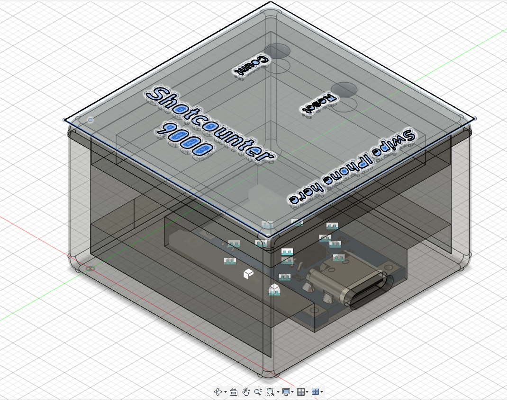
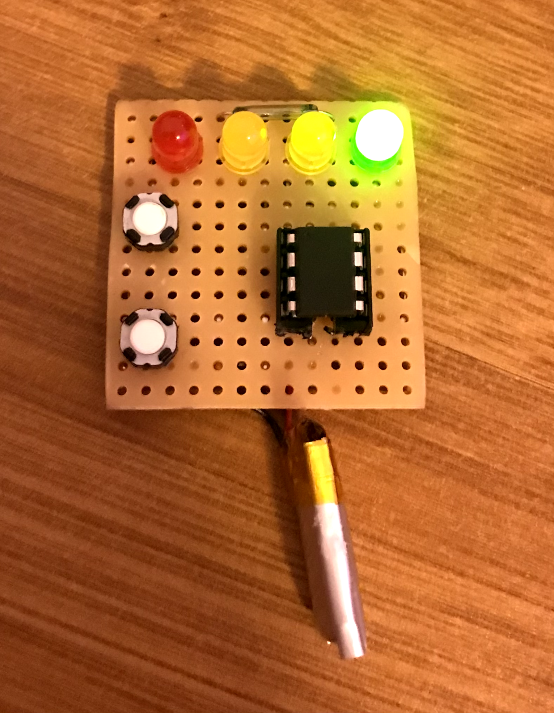
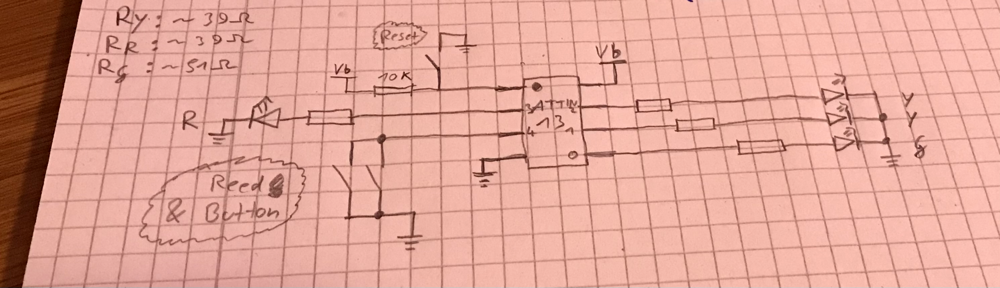

# attiny_shotcounter

Shot counter with an attiny13, reset over button, count over button/magnet

Birthday present for a friend.

Use microcore to build, use 128khz internal clock (and bod set to 2.7v)

